# Mermaid Diagrams untuk BAB II - SpeakenAI Tutor

Dokumen ini berisi kumpulan diagram Mermaid untuk keperluan dokumentasi BAB II Tinjauan Pustaka dan perancangan sistem SpeakenAI Tutor.

---

## 1. Hierarki Kecerdasan Buatan

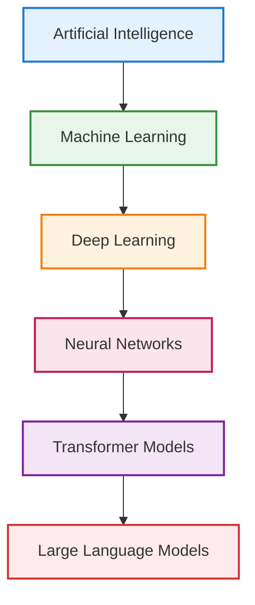

---

## 2. Generic Process Framework (Pressman, 2015)

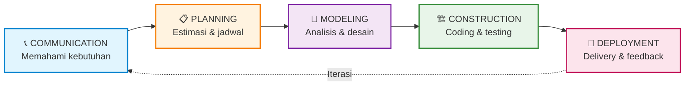

---

## 3. Arsitektur Sistem SpeakenAI (3-Tier)

```mermaid
graph TB
    subgraph FRONTEND["PRESENTATION LAYER (Frontend)"]
        R[React + Vite + TypeScript]
        R --> RP[Roleplay Page]
        R --> CP[Chat Page]
        R --> PP[Profile Page]
        R --> DP[Dashboard Page]
    end

    subgraph BACKEND["BUSINESS LOGIC LAYER (Backend)"]
        E[Express.js + Node.js]
        E --> API1[/api/heygen/token]
        E --> API2[/api/openrouter]
        E --> API3[/api/upload-avatar]
    end

    subgraph DATA["DATA LAYER (External Services)"]
        H[HeyGen API<br/>Avatar + STT/TTS]
        O[OpenRouter API<br/>LLM Llama 3.3]
        S[Supabase<br/>PostgreSQL]
    end

    FRONTEND -->|HTTP/SSE| BACKEND
    API1 --> H
    API2 --> O
    API3 --> S

    style FRONTEND fill:#e3f2fd,stroke:#1976d2,stroke-width:2px
    style BACKEND fill:#e8f5e9,stroke:#388e3c,stroke-width:2px
    style DATA fill:#fff3e0,stroke:#f57c00,stroke-width:2px
```

---

## 4. Sequence Diagram - Alur Roleplay Avatar

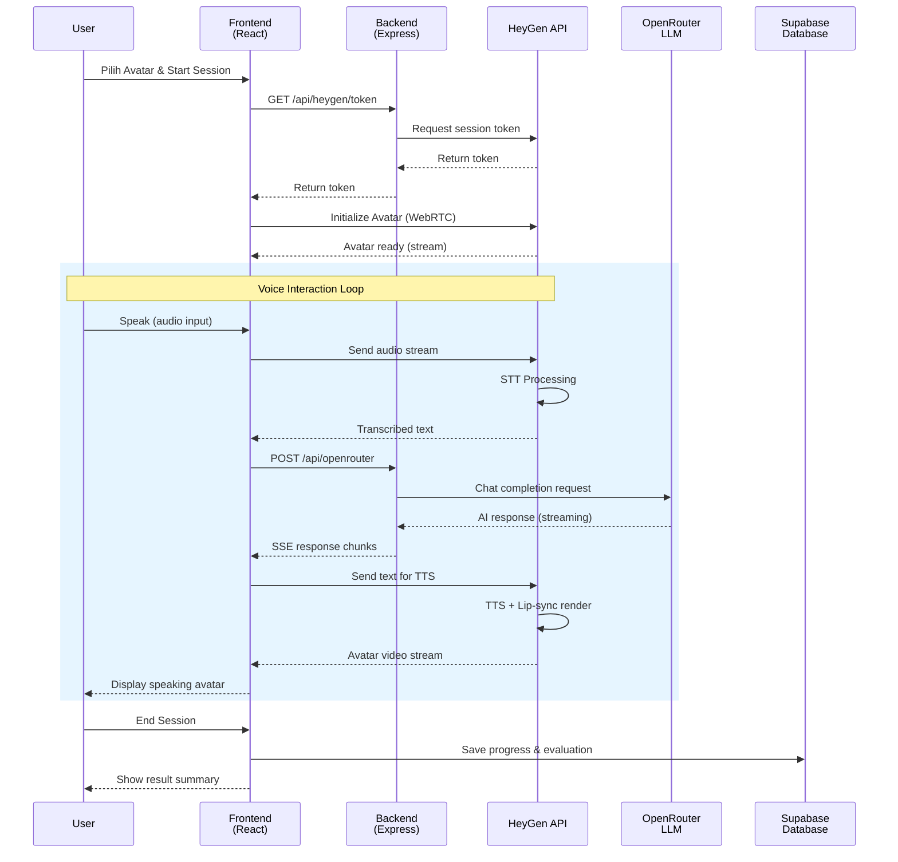

---

## 5. Sequence Diagram - Alur Text Chat

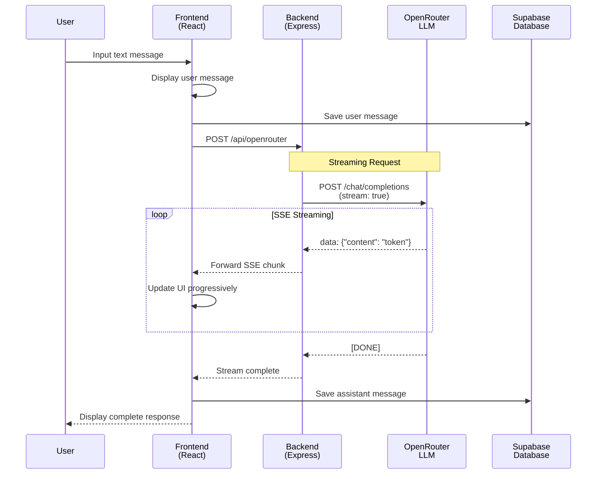

---

## 6. Flowchart - Alur Utama Sistem

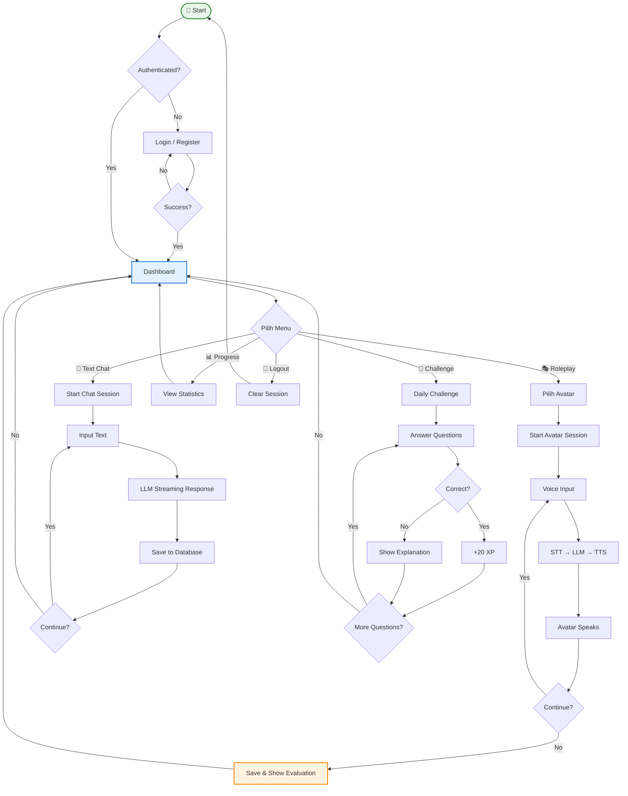

---

## 7. Use Case Diagram

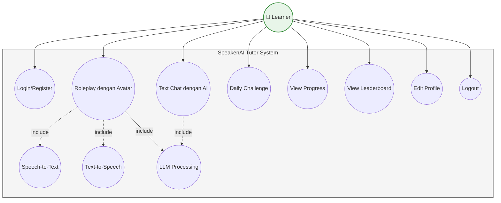

---

## 8. Class Diagram (Entity Relationship)

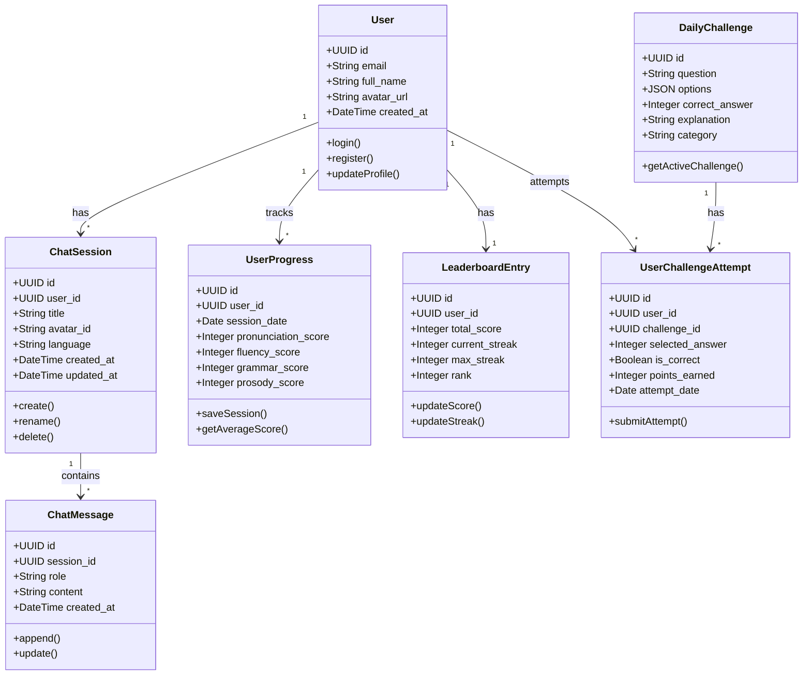

---

## 9. Activity Diagram - Proses Roleplay

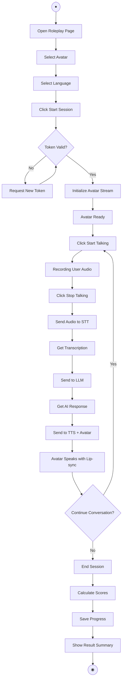

---

## 10. Activity Diagram - Proses Text Chat

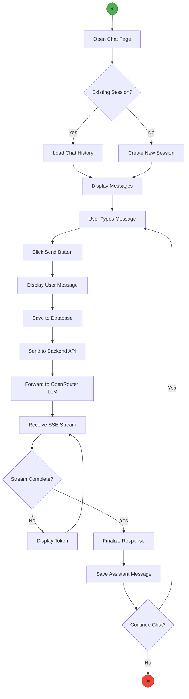

---

## 11. Activity Diagram - Proses Login

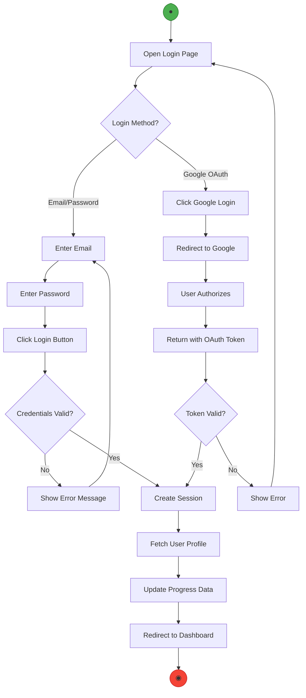

---

## 12. Activity Diagram - Proses Daily Challenge

```mermaid
flowchart TD
    Start([●]) --> A[Open Challenge Page]
    A --> B{Challenge Available?}
    B -->|No| C[Show "Come Back Tomorrow"]
    C --> End1([◉])
    
    B -->|Yes| D[Load Challenge Questions]
    D --> E[Display Question 1]
    
    E --> F[User Selects Answer]
    F --> G{Answer Correct?}
    G -->|Yes| H[Show Correct Feedback]
    H --> I[Add 20 XP]
    G -->|No| J[Show Explanation]
    
    I --> K{More Questions?}
    J --> K
    K -->|Yes| L[Next Question]
    L --> F
    K -->|No| M[Calculate Total Score]
    M --> N[Update Leaderboard]
    N --> O[Update Streak]
    O --> P[Show Result Summary]
    P --> End2([◉])

    style Start fill:#4caf50,stroke:#2e7d32
    style End1 fill:#ff9800,stroke:#ef6c00
    style End2 fill:#f44336,stroke:#c62828
```

---

## 13. Use Case Diagram - Full System

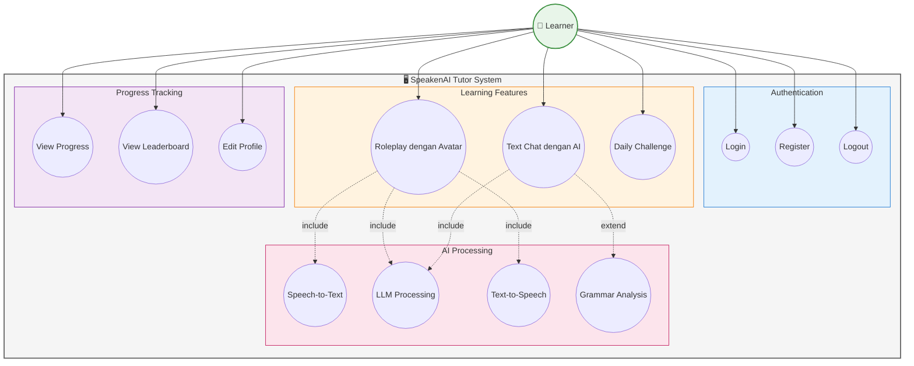

---

## 14. Sequence Diagram - Roleplay Avatar Detail

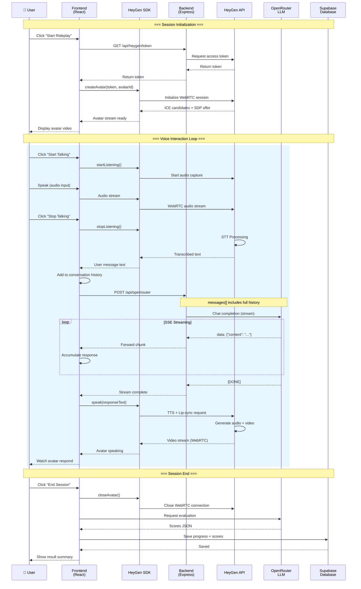

---

## 15. Class Diagram - Full Entity Relationship

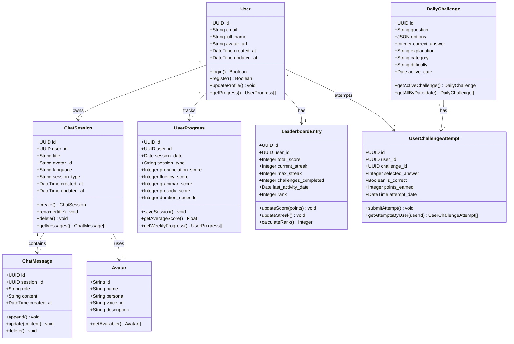

---

## 10. Alur Data Sistem (Data Flow)

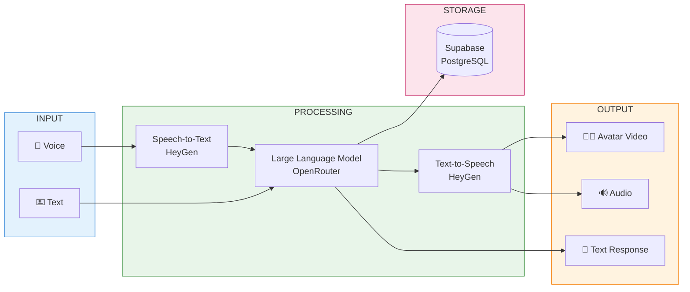

---

## 11. Component Diagram - Tech Stack

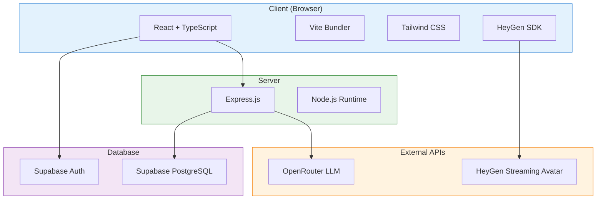

---

## 12. Kerangka Berpikir Penelitian

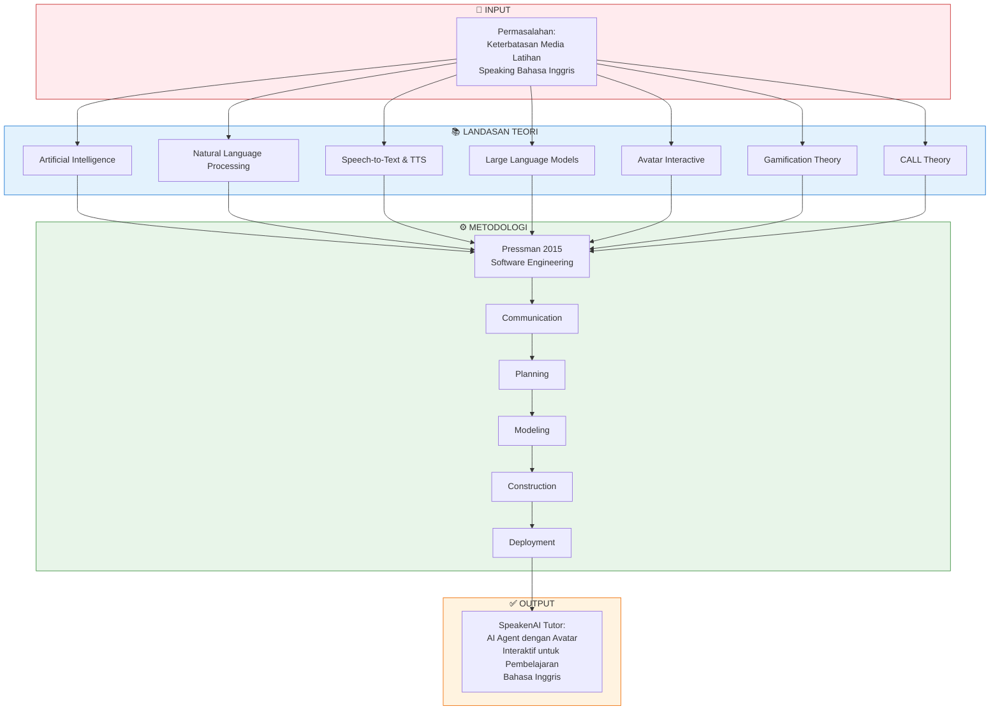

---

## Cara Menggunakan Diagram

### Online Mermaid Editor
1. Buka [Mermaid Live Editor](https://mermaid.live/)
2. Copy kode Mermaid yang diinginkan
3. Paste di editor untuk melihat preview
4. Download sebagai PNG/SVG

### VS Code Extension
1. Install extension "Mermaid Preview" atau "Markdown Preview Mermaid Support"
2. Buka file ini di VS Code
3. Preview akan menampilkan diagram

### Export ke Word/PDF
1. Render diagram menggunakan Mermaid Live Editor
2. Export sebagai PNG atau SVG
3. Insert gambar ke dokumen Word

---

_Dokumen diagram dibuat untuk mendukung BAB II Tinjauan Pustaka SpeakenAI Tutor_  
_Terakhir diperbarui: 4 Februari 2026_
