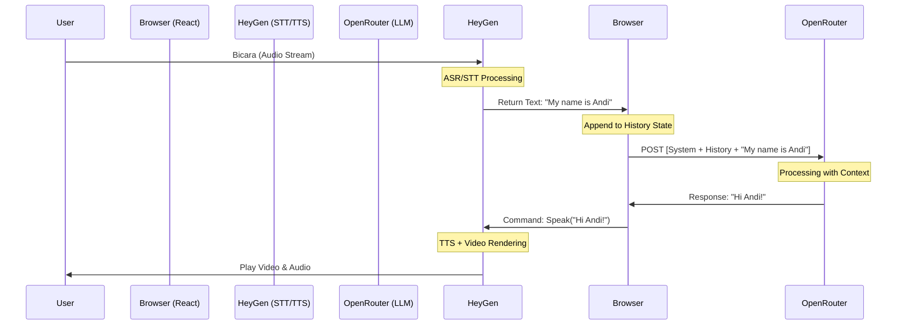

Catatan Teknis: Deep Dive Teknologi HeyGen & OpenRouter
Dokumen ini adalah catatan mendalam mengenai teknologi spesifik yang digunakan oleh HeyGen dan OpenRouter dalam ekosistem aplikasi ini, serta bagaimana keduanya bekerja di balik layar.

1. HeyGen (Interactive Streaming Avatar)
HeyGen menyediakan layanan "Interactive Avatar" yang memungkinkan percakapan real-time dengan karakter AI wujud video.

🛠️ Teknologi Inti yang Digunakan
WebRTC (Web Real-Time Communication)

Fungsi: Digunakan untuk mengirimkan stream video (wajah avatar) dan audio (suara avatar) dari server HeyGen ke browser user dengan latency sangat rendah (sub-500ms).
Detail:
Menggunakan protokol UDP (User Datagram Protocol) untuk kecepatan transmisi data real-time.
Codecs: Kemungkinan besar menggunakan H.264 atau VP8 untuk video, dan Opus untuk audio (standar industri WebRTC).
ICE (Interactive Connectivity Establishment): Proses negosiasi koneksi (handshake) untuk menembus firewall/NAT user menggunakan server STUN/TURN.
WebSocket (wss://)

Fungsi: Digunakan untuk signaling dan mengirimkan data kontrol.
Detail: Saat user berbicara atau mengirim teks, data event (USER_START, USER_STOP) dan teks respons dikirim melalui WebSocket yang persisten, bukan HTTP request biasa. Ini memastikan pertukaran data dua arah yang instan.
Generative AI Rendering (Server-Side)

Fungsi: Merender gerakan bibir (lip-sync) dan ekspresi wajah avatar secara real-time agar sesuai dengan audio yang dihasilkan.
Teknologi: Menggunakan model Deep Learning (seperti GANs atau NeRFs) yang dapat memanipulasi video frame-by-frame secara instan berdasarkan input fonem audio.
STT (Speech-to-Text) & TTS (Text-to-Speech)

Integrated Pipeline: HeyGen memiliki pipeline internal dimana suara user langsung diubah ke teks (STT), dan teks balasan AI diubah kembali ke suara (TTS) dengan voice skin yang sesuai karakter avatar.
🔄 Cara Kerja di Aplikasi (Flow Detail)
Initialization:
Client meminta Access Token ke server kita (GET /api/heygen/token).
Server kita memanggil API HeyGen dengan Secret Key untuk mendapatkan token sementara (berlaku terbatas).
Connection:
Client menggunakan SDK @heygen/streaming-avatar untuk membuka koneksi WebRTC.
Terjadi pertukaran SDP (Session Description Protocol) untuk menyepakati format media.
Interaction:
Mode Voice: Audio microphone user dikirim langsung via WebRTC audio track.
Mode Text: Teks dikirim via data channel/WebSocket.
Feedback Loop:
Avatar mendengarkan -> memproses -> streaming balik video wajah yang sedang berbicara.
2. OpenRouter (LLM Aggregator Proxy)
OpenRouter bertindak sebagai "Router" atau gerbang cerdas menuju berbagai model AI besar (LLM) seperti GPT-4, Claude 3, atau Llama 3.

🛠️ Teknologi Inti yang Digunakan
HTTP/2 & REST API

Fungsi: Standar komunikasi data antara server kita dan OpenRouter.
Detail: Menggunakan format API standar yang kompatibel dengan OpenAI (/chat/completions).
SSE (Server-Sent Events) / Streaming

Fungsi: Memungkinkan AI mengirimkan jawaban "per kata" (token by token) segera setelah dipikirkan, tanpa menunggu seluruh kalimat selesai.
Detail:
Respons HTTP tidak langsung ditutup (Connection: keep-alive).
Data dikirim dalam chunk format teks: data: {"content": "He"}, data: {"content": "llo"}.
Ini memberikan ilusi respons "instant" bagi user.
Transformer Architecture (The Brain)

Fungsi: Model bahasa (seperti Meta Llama 3.3 70B) yang digunakan OpenRouter bekerja dengan arsitektur Transformer.
Mekanisme:
Context Window: Membaca riwayat chat sebelumnya untuk memahami konteks.
Attention Mechanism: Fokus pada kata kunci penting dalam kalimat user.
Probabilistic Generation: Memilih kata berikutnya (next token prediction) berdasarkan probabilitas statistik.
Stateless Authentication

Menggunakan Bearer Token (Authorization: Bearer sk-or-v1...) di setiap request. Server OpenRouter tidak menyimpan state "login" user, murni request-response.
🔄 Cara Kerja Proxy di Server Kita (server/index.ts)
Kita menggunakan teknik Reverse Proxy untuk keamanan:

Client Request: Frontend mengirim request ke localhost:xxxx/api/openrouter (Tanpa API Key).
Server Injection: Endpoint Node.js/Express menerima request, menyuntikkan OPENROUTER_API_KEY dari server environment, lalu meneruskannya ke https://openrouter.ai/....
Stream Piping:
Server tidak menunggu respons penuh dari OpenRouter.
Begitu OpenRouter mengirim satu chunk data, server langsung meneruskannya (pipe) ke Client.
Ini menjaga latensi tetap minimum (seolah-olah client akses langsung, tapi aman).
3. Integrasi: Bagaimana Keduanya "Ngobrol"?
Dalam aplikasi ini, HeyGen dan OpenRouter bekerja secara estafet (sambung-menyambung):

Input: User bicara ke Avatar (HeyGen).
Transkripsi: HeyGen mengonversi suara jadi Teks (STT).
Berpikir (Intelligence): Teks tersebut dikirim ke OpenRouter.
OpenRouter membaca prompt sistem ("Kamu adalah guru bahasa Inggris...").
OpenRouter menghasilkan jawaban teks.
Output: Jawaban teks dari OpenRouter dikirim balik ke HeyGen.
Eksekusi: HeyGen mengonversi teks jadi suara (TTS) dan menggerakkan bibir Avatar (Video Rendering).
Teknologi Kunci Penghubung:

Prompt Engineering: Instruksi khusus yang kita kirim ke OpenRouter agar AI berperilaku seperti tutor yang ramah, bukan robot kaku.
State Management (React): Mengelola giliran bicara (turn-taking) agar user dan avatar tidak saling memotong pembicaraan.

---

## 4. Deep Dive: Context Flow & Reasoning (Engineering Perspective)

Bagaimana sebenarnya sistem "mengingat" pembicaraan? Berikut adalah bedah teknis alur data (Data Flow) untuk Contextual Understanding.

### 🧠 The Stateless Problem
LLM (Large Language Model) seperti Llama 3 atau GPT-4 sifatnya **Stateless**. Artinya, setiap request API adalah event baru yang terisolasi. Jika Anda mengirim "Siapa nama saya?" di request kedua, LLM tidak akan tahu jawabannya meskipun Anda sudah menyebutkan nama di request pertama, KECUALI Anda mengirim ulang seluruh percakapan.

### 🏗️ Engineering Architecture: The "Memory" Orchestrator

Dalam arsitektur SpeakenAI, **Frontend React Client** bertindak sebagai *Orchestrator* yang menjembatani HeyGen (Mata & Telinga) dengan OpenRouter (Otak & Memori).

**Flow Lengkap (Data Ingestion to Synthesis):**

#### Phase 1: Ingestion & Transduction (HeyGen)
1.  **Audio Stream (WebRTC)**: Browser mengirim buffer audio raw via protokol UDP ke server HeyGen.
2.  **ASR (Automatic Speech Recognition)**:
    *   Server HeyGen menerima stream audio.
    *   Model ASR (seperti Whisper atau proprietary model) mengonversi gelombang suara menjadi string teks.
    *   *Latency Critical*: Proses ini terjadi dalam milidetik.
3.  **Event Callback (`USER_STOPS_TALKING`)**:
    *   HeyGen mendeteksi silence (VAD - Voice Activity Detection).
    *   HeyGen mengirim event WebSocket ke Frontend React kita:
        ```json
        {
          "type": "avatar_event",
          "event_type": "user_message",
          "text": "Hello, my name is Andi." // Hasil STT
        }
        ```

#### Phase 2: Context Injection (React Client)
Disinilah "Context Understanding" terjadi. Client tidak langsung mengirim teks tersebut ke AI.

1.  **State Appending**:
    *   React State `messages[]` diupdate:
        ```typescript
        const newHistory = [
            ...previousHistory,
            { role: "user", content: "Hello, my name is Andi." }
        ];
        ```
2.  **Context Construction (Prompting)**:
    *   Kita menyusun payload raksasa untuk dikirim ke OpenRouter. Payload ini berisi 3 lapisan:
        *   **System Prompt** (Layer Instruksi): "You are an English tutor. Correct grammar mistakes."
        *   **Conversation History** (Layer Memori): Semua chat `user` dan `assistant` sebelumnya.
        *   **New Input** (Layer Trigger): Pesan baru dari user.

    *   *Payload structure engineer view:*
        ```json
        {
          "model": "meta-llama/llama-3.3-70b-instruct",
          "messages": [
             {"role": "system", "content": "You are a helpful tutor..."}, // Instruksi Global
             {"role": "user", "content": "Hi"},
             {"role": "assistant", "content": "Hello! How can I help?"},
             {"role": "user", "content": "Hello, my name is Andi."} // Input Baru
          ]
        }
        ```

#### Phase 3: Inference & Reasoning (OpenRouter/LLM)
1.  **Tokenization**: LLM menerima seluruh payload di atas.
2.  **Attention Mechanism**:
    *   Saat memproses input baru "Hello, my name is Andi.", *Self-Attention mechanism* pada transformer melihat kembali ke token-token sebelumnya (History).
    *   Model membangun "state internal" sementara untuk request ini yang memahami bahwa user bernama Andi.
3.  **Generation**:
    *   Model memprediksi token jawaban: "Nice to meet you, Andi!"
    *   *Note*: Model tahu nama "Andi" bukan karena dia "ingat", tapi karena kita "menyuapinya" ulang informasi tersebut di message history.

#### Phase 4: Synthesis & Synchronization (HeyGen)
1.  **Text Handoff**:
    *   React Client menerima teks jawaban dari OpenRouter: "Nice to meet you, Andi!"
    *   Client memanggil SDK HeyGen: `avatar.speak({ text: "Nice to meet you, Andi!" })`.
2.  **TTS (Text-to-Speech) Generation**:
    *   Server HeyGen mengonversi teks ke Audio Buffer (MP3/WAV).
3.  **Lip-Sync Rendering**:
    *   Engine HeyGen menganalisis fonem suara (e.g., bentuk mulut untuk huruf "O", "M", "P").
    *   Video frame dimodifikasi secara real-time (Warping) agar bibir avatar sinkron dengan suara.
4.  **Packet Delivery**:
    *   Video & Audio dikirim kembali ke browser user via WebRTC.

### 🚀 Kesimpulan Engineering Flow
Sistem ini menarik karena mengandalkan **Client Application** sebagai "Short-Term Memory" yang persisten. AI itu sendiri pelupa (stateless), sehingga kode React kitalah yang bertugas "mengingatkan" AI tentang konteks percakapan di setiap kali interaksi.

