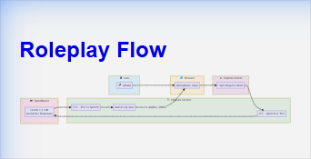
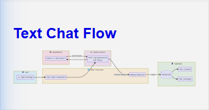
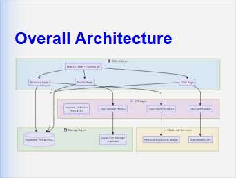

# Perancangan Sistem SpeakenAI

Dokumen ini menjelaskan perancangan arsitektur dan desain sistem **SpeakenAI Tutor**.

---

## Perancangan Arsitektur

Arsitektur SpeakenAI terdiri atas:

| Komponen           | Teknologi                      | Fungsi                                          |
| ------------------ | ------------------------------ | ----------------------------------------------- |
| **Frontend**       | React + Vite + TypeScript      | Halaman roleplay, text chat, profile, dashboard |
| **Backend**        | Express.js (Node.js)           | API utama sistem & proxy ke external services   |
| **Database**       | Supabase (PostgreSQL)          | Penyimpanan user data, chat history, progress   |
| **AI Agent**       | OpenRouter API (Llama 3.3 70B) | Chatbot conversational AI                       |
| **Avatar Service** | HeyGen Streaming Avatar        | Avatar interaktif dengan lip-sync               |
| **STT Service**    | HeyGen Built-in STT            | Konversi suara ke teks                          |
| **TTS Service**    | HeyGen Built-in TTS            | Konversi teks ke suara avatar                   |
| **File Storage**   | Local Storage (uploads/)       | Penyimpanan avatar upload pengguna              |

---

## Diagram Arsitektur Komponen

```
┌────────────────────────────────────────────────────────────────────────────┐
│                              USER (Browser)                                │
│  ┌──────────────────────────────────────────────────────────────────────┐  │
│  │                     FRONTEND (React + Vite + TS)                     │  │
│  │                                                                      │  │
│  │  ┌────────────┐  ┌────────────┐  ┌────────────┐  ┌────────────┐      │  │
│  │  │  Roleplay  │  │    Chat    │  │  Profile   │  │ Dashboard  │      │  │
│  │  │    Page    │  │    Page    │  │    Page    │  │    Page    │      │  │
│  │  └─────┬──────┘  └─────┬──────┘  └─────┬──────┘  └─────┬──────┘      │  │
│  │        │               │               │               │             │  │
│  │        └───────────────┴───────────────┴───────────────┘             │  │
│  │                                │                                     │  │
│  │                    ┌───────────┴───────────┐                         │  │
│  │                    │   React Hooks Layer   │                         │  │
│  │                    │  • useAvatarSession   │                         │  │
│  │                    │  • useChatSession     │                         │  │
│  │                    │  • useUserProgress    │                         │  │
│  │                    │  • useLeaderboard     │                         │  │
│  │                    └───────────┬───────────┘                         │  │
│  └────────────────────────────────┼─────────────────────────────────────┘  │
└───────────────────────────────────┼────────────────────────────────────────┘
                                    │
                                    │ HTTP/SSE
                                    ▼
┌────────────────────────────────────────────────────────────────────────────┐
│                        BACKEND (Express.js + Node.js)                      │
│                              Port: 8787                                    │
│  ┌──────────────────────────────────────────────────────────────────────┐  │
│  │                           API Endpoints                              │  │
│  │                                                                      │  │
│  │  ┌─────────────────┐  ┌─────────────────┐  ┌─────────────────────┐   │  │
│  │  │ GET /api/heygen │  │ POST /api/      │  │ POST /api/upload-   │   │  │
│  │  │     /token      │  │   openrouter    │  │      avatar         │   │  │
│  │  │                 │  │     (SSE)       │  │                     │   │  │
│  │  │ Mint HeyGen     │  │ Proxy ke LLM    │  │ Upload user avatar  │   │  │
│  │  │ session token   │  │ dengan streaming│  │ ke local storage    │   │  │
│  │  └────────┬────────┘  └────────┬────────┘  └──────────┬──────────┘   │  │
│  └───────────┼────────────────────┼──────────────────────┼──────────────┘  │
└──────────────┼────────────────────┼──────────────────────┼─────────────────┘
               │                    │                      │
               ▼                    ▼                      ▼
┌──────────────────────┐  ┌──────────────────────┐  ┌──────────────────────┐
│    HEYGEN SERVICE    │  │   OPENROUTER API     │  │    LOCAL STORAGE     │
│                      │  │                      │  │                      │
│  ┌────────────────┐  │  │  ┌────────────────┐  │  │  ┌────────────────┐  │
│  │ Streaming      │  │  │  │ Meta Llama     │  │  │  │ /uploads/      │  │
│  │ Avatar API     │  │  │  │ 3.3 70B        │  │  │  │   {userId}/    │  │
│  │                │  │  │  │ Instruct       │  │  │  │     avatar.jpg │  │
│  │ • Avatar       │  │  │  │                │  │  │  │                │  │
│  │ • Lip-sync     │  │  │  │ Chat           │  │  │  │ Static file    │  │
│  │ • STT          │  │  │  │ Completions    │  │  │  │ serving        │  │
│  │ • TTS          │  │  │  │ (Streaming)    │  │  │  │                │  │
│  └────────────────┘  │  │  └────────────────┘  │  │  └────────────────┘  │
└──────────────────────┘  └──────────────────────┘  └──────────────────────┘
               │
               │ Direct Client Connection (WebRTC/WebSocket)
               │
┌──────────────┴─────────────────────────────────────────────────────────────┐
│                          HEYGEN STREAMING AVATAR                           │
│                                                                            │
│  ┌─────────────────────────────────────────────────────────────────────┐   │
│  │                        Avatar Personas                              │   │
│  │                                                                     │   │
│  │  ┌──────────┐ ┌──────────┐ ┌──────────┐ ┌──────────┐ ┌──────────┐   │   │
│  │  │   Ann    │ │  Shawn   │ │  Bryan   │ │  Dexter  │ │ Elenora  │   │   │
│  │  │Therapist │ │Therapist │ │  Coach   │ │  Doctor  │ │   Tech   │   │   │
│  │  │          │ │          │ │          │ │          │ │  Expert  │   │   │
│  │  │Supportive│ │  Direct  │ │Energetic │ │  Formal  │ │Analytical│   │   │
│  │  │Counselor │ │Counselor │ │Motivator │ │  Expert  │ │Consultant│   │   │
│  │  └──────────┘ └──────────┘ └──────────┘ └──────────┘ └──────────┘   │   │
│  └─────────────────────────────────────────────────────────────────────┘   │
└────────────────────────────────────────────────────────────────────────────┘


┌─────────────────────────────────────────────────────────────────────────────┐
│                        SUPABASE (PostgreSQL Cloud)                          │
│                                                                             │
│  ┌───────────────────────────────────────────────────────────────────────┐  │
│  │                           Database Tables                             │  │
│  │                                                                       │  │
│  │  ┌─────────────┐  ┌─────────────┐  ┌─────────────┐  ┌─────────────┐   │  │
│  │  │   users     │  │chat_sessions│  │chat_messages│  │user_progress│   │  │
│  │  │             │  │             │  │             │  │             │   │  │
│  │  │• id         │  │• id         │  │• id         │  │• user_id    │   │  │
│  │  │• email      │  │• user_id    │  │• session_id │  │• level      │   │  │
│  │  │• name       │  │• avatar_id  │  │• role       │  │• xp_points  │   │  │
│  │  │• avatar_url │  │• language   │  │• content    │  │• streak     │   │  │
│  │  │• created_at │  │• created_at │  │• created_at │  │• updated_at │   │  │
│  │  └─────────────┘  └─────────────┘  └─────────────┘  └─────────────┘   │  │
│  │                                                                       │  │
│  │  ┌─────────────┐  ┌─────────────┐  ┌─────────────┐                    │  │
│  │  │ challenges  │  │ leaderboard │  │   scores    │                    │  │
│  │  │             │  │             │  │             │                    │  │
│  │  │• id         │  │• user_id    │  │• session_id │                    │  │
│  │  │• type       │  │• total_xp   │  │• grammar    │                    │  │
│  │  │• target     │  │• rank       │  │• fluency    │                    │  │
│  │  │• progress   │  │• updated_at │  │• feedback   │                    │  │
│  │  └─────────────┘  └─────────────┘  └─────────────┘                    │  │
│  └───────────────────────────────────────────────────────────────────────┘  │
│                                                                             │
│  ┌───────────────────────────────────────────────────────────────────────┐  │
│  │                         Supabase Auth                                 │  │
│  │  • Email/Password Authentication                                      │  │
│  │  • Google OAuth Provider                                              │  │
│  │  • JWT Token Management                                               │  │
│  │  • Row Level Security (RLS)                                           │  │
│  └───────────────────────────────────────────────────────────────────────┘  │
└─────────────────────────────────────────────────────────────────────────────┘
```

---

## Alur Data (Data Flow)

### 1. Alur Roleplay dengan Avatar

## Alur Data (Data Flow)

### 1. Alur Roleplay dengan Avatar



### 2. Alur Text Chat



### 3. Arsitektur Keseluruhan



---

## Struktur Folder Proyek

```
Speaken-AI-Tutor/
├── src/
│   ├── components/           # UI Components
│   │   ├── AvatarSession/    # Avatar roleplay components
│   │   ├── ChatInterface/    # Text chat components
│   │   ├── ui/               # Reusable UI primitives
│   │   └── *.tsx             # Page components
│   ├── hooks/                # Custom React hooks
│   │   ├── useAvatarSession.ts
│   │   ├── useChatSession.ts
│   │   ├── useUserProgress.ts
│   │   └── useLeaderboard.ts
│   ├── lib/                  # Utilities & constants
│   │   └── constants.ts      # Avatar list, STT languages
│   ├── i18n/                 # Internationalization
│   │   └── locales/          # Language files
│   ├── supabase/             # Supabase client
│   │   └── client.ts
│   ├── App.tsx               # Main app with routing
│   └── main.tsx              # Entry point
├── server/
│   └── index.ts              # Express API server
├── supabase/
│   └── migrations/           # Database migrations
├── public/                   # Static assets
├── uploads/                  # User uploaded avatars
├── package.json
├── vite.config.ts
└── .env                      # Environment variables
```

---

## Environment Variables

```env
# Client-side (VITE_ prefix)
VITE_API_BASE=http://localhost:8787
VITE_SUPABASE_URL=https://xxxx.supabase.co
VITE_SUPABASE_ANON_KEY=eyJxxxx...
VITE_OPENROUTER_API_KEY=sk-or-v1-xxxx  # Optional fallback

# Server-side (No VITE_ prefix - kept secure)
PORT=8787
HEYGEN_API_KEY=sk-xxxx
OPENROUTER_API_KEY=sk-or-v1-xxxx
```

---

_Dokumen ini dibuat berdasarkan analisis sistem Speaken-AI-Tutor_  
_Terakhir diperbarui: 20 Januari 2026_
