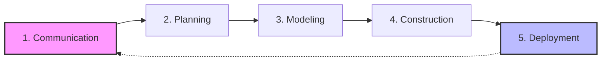
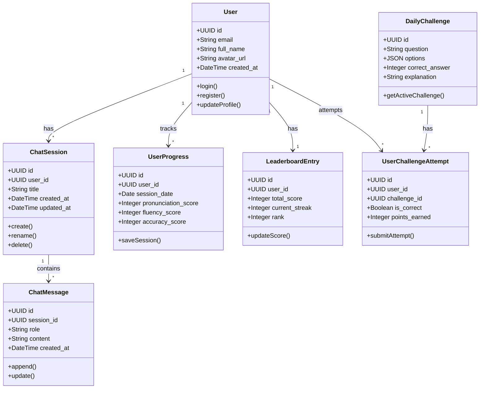
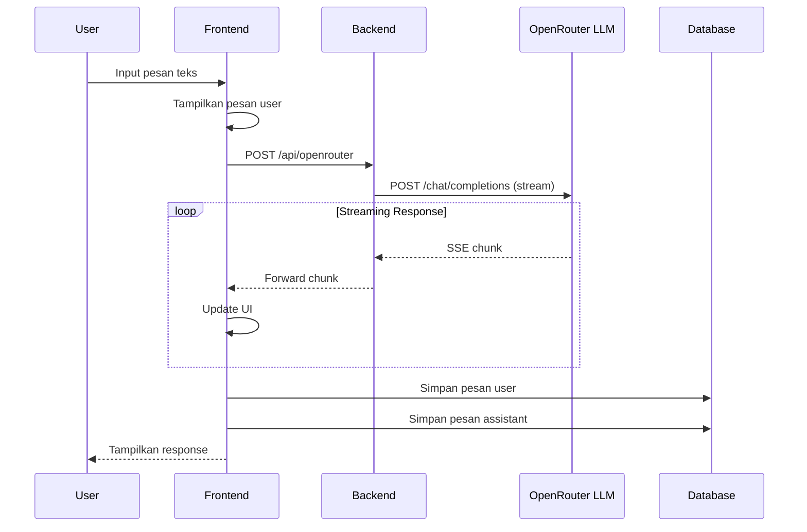
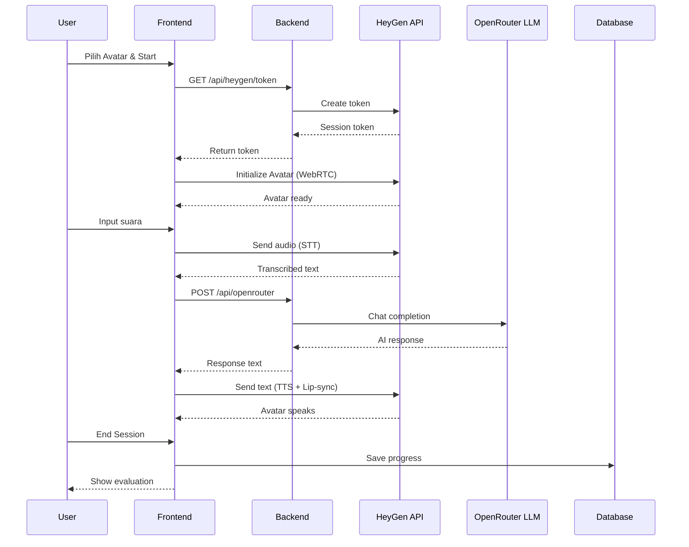
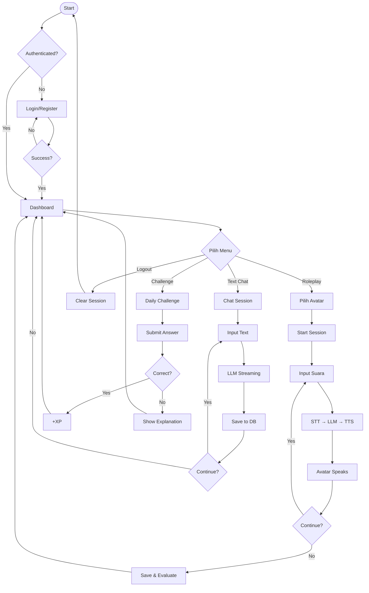

# 📘 BAB III - METODOLOGI PENELITIAN

## 🏗️ 3.1 Metodologi Pengembangan Sistem

> [!NOTE]
> Pengembangan sistem **SpeakenAI Tutor** menggunakan metodologi **Software Engineering** yang dikemukakan oleh Roger S. Pressman (2015). Metodologi ini merupakan pendekatan sistematis dalam pengembangan perangkat lunak yang terdiri dari lima tahapan utama.



**Gambar 3.1** Diagram Alur Metodologi Pressman (2015)

---

## 🗣️ 3.2 Communication (Komunikasi)

> [!IMPORTANT]
> Tahap komunikasi merupakan tahap awal untuk memahami kebutuhan pengguna dan stakeholder. Pada tahap ini dilakukan identifikasi masalah, pengumpulan kebutuhan, dan analisis sistem.

### 3.2.1 Identifikasi Masalah

Berdasarkan observasi dan wawancara, ditemukan beberapa masalah dalam pembelajaran bahasa Inggris konvensional:

| No  | Masalah                                     | Dampak                                          |
| --- | ------------------------------------------- | ----------------------------------------------- |
| 1   | Kurangnya partner latihan percakapan        | Kemampuan speaking tidak berkembang             |
| 2   | Keterbatasan waktu dan tempat untuk belajar | Proses pembelajaran tidak fleksibel             |
| 3   | Tidak ada feedback langsung pronunciation   | Kesalahan berulang tanpa koreksi                |
| 4   | Metode pembelajaran monoton                 | Motivasi belajar menurun                        |
| 5   | Biaya kursus bahasa yang mahal              | Akses pembelajaran terbatas untuk kalangan umum |

**Tabel 3.1** Identifikasi Masalah Pembelajaran Bahasa Inggris Konvensional

### 3.2.2 Analisis Kebutuhan Pengguna

Aktor utama dalam sistem ini adalah **Learner (Pelajar Bahasa)** yang memiliki kebutuhan sebagai berikut:

| Kebutuhan          | Deskripsi                                         |
| ------------------ | ------------------------------------------------- |
| Latihan Percakapan | Membutuhkan partner untuk berlatih speaking       |
| Feedback Real-time | Koreksi grammar dan pronunciation secara langsung |
| Fleksibilitas      | Belajar kapan saja dan di mana saja               |
| Personalisasi      | Materi disesuaikan dengan level kemampuan         |
| Gamifikasi         | Elemen permainan untuk meningkatkan motivasi      |

**Tabel 3.2** Analisis Kebutuhan Pengguna (Learner)

### 3.2.3 Kebutuhan Fungsional

Kebutuhan fungsional adalah layanan yang harus disediakan oleh sistem:

| Kode  | Kebutuhan Fungsional | Deskripsi                                                |
| ----- | -------------------- | -------------------------------------------------------- |
| FR-01 | Autentikasi Pengguna | Registrasi dan login menggunakan email atau Google OAuth |
| FR-02 | AI Conversational    | Percakapan berbasis teks/suara dengan AI (LLM)           |
| FR-03 | Speech-to-Text (STT) | Konversi suara pengguna ke teks                          |
| FR-04 | Text-to-Speech (TTS) | Konversi respons AI ke audio natural                     |
| FR-05 | Avatar Interaktif    | Avatar virtual dengan lip-sync real-time                 |
| FR-06 | Chat Interface       | Dua mode: Text Chat dan Roleplay dengan avatar           |
| FR-07 | Progress Tracking    | Evaluasi grammar, fluency, pronunciation dengan skor     |
| FR-08 | Gamifikasi           | Daily challenges, XP points, leaderboard                 |
| FR-09 | Penyimpanan Data     | Data tersimpan di cloud database                         |

**Tabel 3.3** Daftar Kebutuhan Fungsional Sistem

### 🛠️ 3.2.4 Kebutuhan Non-Fungsional

Kebutuhan non-fungsional adalah batasan dan standar kualitas sistem:

| Kode   | Kebutuhan        | Deskripsi                                |
| :----- | :--------------- | :--------------------------------------- |
| NFR-01 | **Performa**     | Response LLM maksimal 2-4 detik          |
| NFR-02 | **Keamanan**     | API keys tersimpan di server, RLS aktif  |
| NFR-03 | **Reliabilitas** | Fallback ke text-only jika avatar gagal  |
| NFR-04 | **Usability**    | Dark/light theme, responsive, multi-lang |
| NFR-05 | **Portabilitas** | Cross-browser dan cross-platform         |

**Tabel 3.4** Daftar Kebutuhan Non-Fungsional Sistem

---

## 📅 3.3 Planning (Perencanaan)

Tahap perencanaan meliputi penjadwalan proyek, estimasi sumber daya, pemilihan teknologi, dan analisis risiko.

### ⏱️ 3.3.1 Estimasi Waktu Pengembangan

| No  | Tahapan       | Durasi        | Kegiatan                           |
| :-- | :------------ | :------------ | :--------------------------------- |
| 1   | Communication | 1 minggu      | Analisis kebutuhan, wawancara      |
| 2   | Planning      | 1 minggu      | Perencanaan arsitektur, resource   |
| 3   | Modeling      | 2 minggu      | Desain UML, database, UI/UX        |
| 4   | Construction  | 6 minggu      | Implementasi frontend, backend, AI |
| 5   | Deployment    | 2 minggu      | Testing, deployment, dokumentasi   |
|     | **Total**     | **12 minggu** |                                    |

**Tabel 3.5** Estimasi Waktu Pengembangan Sistem

---

### 💻 3.3.2 Teknologi yang Digunakan

| Layer              | Teknologi                  | Fungsi                 |
| :----------------- | :------------------------- | :--------------------- |
| **Frontend**       | React + Vite + TypeScript  | UI halaman web         |
| **Backend**        | Express.js (Node.js)       | API server             |
| **Database**       | Supabase (PostgreSQL)      | Penyimpanan data       |
| **AI Agent**       | OpenRouter (Llama 3.3 70B) | Chatbot conversational |
| **Avatar Service** | HeyGen Streaming Avatar    | Avatar interaktif      |
| **STT/TTS**        | HeyGen Built-in            | Konversi suara ↔ teks  |

**Tabel 3.6** Daftar Teknologi yang Digunakan

---

### ⚠️ 3.3.3 Analisis Risiko

| Risiko                       | Dampak     | Mitigasi                            |
| :--------------------------- | :--------- | :---------------------------------- |
| API HeyGen down              | **Tinggi** | Fallback ke mode text-only          |
| Quota OpenRouter habis       | **Sedang** | Monitoring usage, rate limiting     |
| Koneksi internet pengguna    | **Sedang** | Optimasi streaming, caching         |
| Browser tidak support WebRTC | **Rendah** | Deteksi browser, info compatibility |

**Tabel 3.7** Analisis Risiko dan Mitigasi

---

## 🎨 3.4 Modeling (Pemodelan)

> [!NOTE]
> Tahap pemodelan merupakan tahap perancangan sistem yang meliputi arsitektur sistem, perancangan database, dan perancangan alur sistem.

### 🏛️ 3.4.1 Arsitektur Sistem

Sistem menggunakan arsitektur **3-Tier** yang memisahkan presentation layer, business logic layer, dan data layer:

```
┌─────────────────────────────────────────────────────────────────┐
│                   PRESENTATION LAYER (Frontend)                 │
│              React + Vite + TypeScript + Tailwind               │
│  ┌──────────┐  ┌──────────┐  ┌──────────┐  ┌──────────┐        │
│  │ Roleplay │  │   Chat   │  │ Progress │  │ Profile  │        │
│  └────┬─────┘  └────┬─────┘  └────┬─────┘  └────┬─────┘        │
│       └─────────────┴─────────────┴─────────────┘              │
└───────────────────────────────┬─────────────────────────────────┘
                                │ HTTP/SSE
                                ▼
┌─────────────────────────────────────────────────────────────────┐
│                   BUSINESS LOGIC LAYER (Backend)                │
│                    Express.js + Node.js                         │
│  ┌─────────────────┐  ┌─────────────────┐  ┌─────────────────┐ │
│  │ /api/heygen     │  │ /api/openrouter │  │ /api/upload     │ │
│  └────────┬────────┘  └────────┬────────┘  └────────┬────────┘ │
└───────────┼────────────────────┼────────────────────┼───────────┘
            ▼                    ▼                    ▼
┌──────────────────┐  ┌──────────────────┐  ┌──────────────────┐
│  HeyGen API      │  │  OpenRouter API  │  │  Supabase        │
│  (Avatar+STT+TTS)│  │  (LLM Llama 3.3) │  │  (PostgreSQL)    │
└──────────────────┘  └──────────────────┘  └──────────────────┘
                      DATA LAYER (External Services)
```

**Gambar 3.2** Arsitektur Sistem 3-Tier SpeakenAI Tutor

### 📊 3.4.2 Class Diagram

Class Diagram menggambarkan struktur entitas database dan relasi antar entitas dalam sistem:



**Gambar 3.3** Class Diagram Sistem SpeakenAI Tutor

### 🔄 3.4.3 Sequence Diagram - Alur Text Chat

Sequence Diagram berikut menggambarkan urutan interaksi antar komponen saat pengguna melakukan text chat dengan AI:



**Gambar 3.4** Sequence Diagram Alur Text Chat

### 🎭 3.4.4 Sequence Diagram - Alur Roleplay Avatar

Sequence Diagram berikut menggambarkan urutan interaksi saat pengguna menggunakan fitur roleplay dengan avatar:



**Gambar 3.5** Sequence Diagram Alur Roleplay dengan Avatar

### 🛣️ 3.4.5 Flowchart - Alur Utama Sistem

Flowchart berikut menggambarkan alur navigasi dan proses utama dalam sistem SpeakenAI Tutor:



**Gambar 3.6** Flowchart Alur Utama Sistem SpeakenAI Tutor

### 🖥️ 3.4.6 Perancangan Antarmuka

Berikut adalah daftar halaman yang dirancang dalam sistem:

| No  | Halaman        | Route             | Deskripsi                |
| --- | -------------- | ----------------- | ------------------------ |
| 1   | Login          | `/login`          | Autentikasi email/Google |
| 2   | Register       | `/register`       | Pendaftaran akun         |
| 3   | Home           | `/home`           | Dashboard utama          |
| 4   | Roleplay       | `/roleplay`       | Voice chat dengan avatar |
| 5   | Text Chat      | `/chat`           | Text chat dengan AI      |
| 6   | Progress       | `/progress`       | Grafik progress          |
| 7   | History        | `/history`        | Riwayat sesi             |
| 8   | Challenge      | `/challenge`      | Daily challenge          |
| 9   | Leaderboard    | `/leaderboard`    | Ranking pengguna         |
| 10  | Profile        | `/profile`        | Pengaturan profil        |
| 11  | Settings       | `/settings`       | Pengaturan aplikasi      |
| 12  | Result Summary | `/result-summary` | Evaluasi setelah sesi    |

**Tabel 3.8** Daftar Halaman dan Routing Sistem

---

## 🏗️ 3.5 Construction (Konstruksi)

> [!TIP]
> Tahap konstruksi merupakan tahap implementasi kode program berdasarkan desain yang telah dibuat. Detail implementasi dibahas secara mendalam pada **BAB IV**.

### 3.5.1 Implementasi Frontend

| Komponen         | Deskripsi                    |
| ---------------- | ---------------------------- |
| Framework        | React + Vite + TypeScript    |
| Komponen UI      | 36+ komponen React           |
| State Management | React Hooks (8 custom hooks) |
| Routing          | React Router DOM             |
| Styling          | Tailwind CSS + Radix UI      |

**Tabel 3.9** Ringkasan Implementasi Frontend

### 3.5.2 Implementasi Backend

| Komponen      | Deskripsi                |
| ------------- | ------------------------ |
| Server        | Express.js (Node.js)     |
| API Endpoints | 3 endpoints utama        |
| Streaming     | Server-Sent Events (SSE) |
| File Upload   | Local storage (uploads/) |

**Tabel 3.10** Ringkasan Implementasi Backend

### 3.5.3 Implementasi Database

| Komponen | Deskripsi                   |
| -------- | --------------------------- |
| Platform | Supabase (PostgreSQL Cloud) |
| Tabel    | 9 tabel utama               |
| Migrasi  | 11 file migrasi SQL         |
| Keamanan | Row Level Security (RLS)    |

**Tabel 3.11** Ringkasan Implementasi Database

---

## 🚀 3.6 Deployment (Penyebaran)

Tahap deployment meliputi penyebaran sistem ke lingkungan produksi dan konfigurasi environment.

### 3.6.1 Environment Configuration

| Variable               | Tipe        | Deskripsi                   |
| ---------------------- | ----------- | --------------------------- |
| VITE_API_BASE          | Client-side | URL base API backend        |
| VITE_SUPABASE_URL      | Client-side | URL Supabase project        |
| VITE_SUPABASE_ANON_KEY | Client-side | Anonymous key Supabase      |
| PORT                   | Server-side | Port server (default: 8787) |
| HEYGEN_API_KEY         | Server-side | API key HeyGen (secure)     |
| OPENROUTER_API_KEY     | Server-side | API key OpenRouter (secure) |

**Tabel 3.12** Daftar Environment Variables

### 3.6.2 Deployment Platform

| Komponen | Platform | Keterangan           |
| -------- | -------- | -------------------- |
| Frontend | Vercel   | Static hosting + CDN |
| Backend  | Railway  | Node.js container    |
| Database | Supabase | Managed PostgreSQL   |

**Tabel 3.13** Platform Deployment

---

## 🧪 3.7 Metode Pengujian

> [!IMPORTANT]
> Pengujian sistem menggunakan metode **Black Box Testing**. Metode ini berfokus pada validasi fungsionalitas sistem berdasarkan input dan output tanpa mengevaluasi struktur internal kode (Pressman, 2015).

### 3.7.1 Definisi Black Box Testing

Black Box Testing adalah teknik pengujian perangkat lunak yang menguji fungsionalitas aplikasi tanpa melihat struktur internal atau kode program. Pengujian dilakukan dari perspektif pengguna akhir (end-user).

### 3.7.2 Tujuan Pengujian

1. Memvalidasi seluruh kebutuhan fungsional telah terpenuhi
2. Memastikan sistem menghasilkan output yang sesuai ekspektasi
3. Mengidentifikasi error atau bug pada antarmuka pengguna
4. Menguji skenario positif dan negatif untuk setiap fungsi

### 3.7.3 Rancangan Test Case

| Kategori              | Jumlah Test Case | Deskripsi                         |
| --------------------- | ---------------- | --------------------------------- |
| Autentikasi           | 9                | Login, register, logout, OAuth    |
| Roleplay (Voice)      | 9                | Avatar, STT, TTS, lip-sync        |
| Text Chat             | 8                | Kirim pesan, streaming, history   |
| Daily Challenge       | 5                | Challenge, submit, XP             |
| Progress & Evaluation | 7                | Skor, grafik, evaluasi            |
| Leaderboard           | 3                | Ranking, filter, position         |
| Profile & Settings    | 7                | Edit profil, upload avatar, theme |
| API Server            | 5                | Token, proxy, CORS                |
| Database              | 5                | CRUD, RLS, data integrity         |
| **TOTAL**             | **58**           |                                   |

**Tabel 3.14** Rancangan Kategori Test Case

### 3.7.4 Format Tabel Pengujian

Setiap test case didokumentasikan dengan format sebagai berikut:

| Kolom                  | Deskripsi                                |
| ---------------------- | ---------------------------------------- |
| No                     | Nomor urut test case                     |
| Fungsi yang Diuji      | Nama fungsi atau fitur yang diuji        |
| Skenario               | Kondisi pengujian (positif/negatif)      |
| Input                  | Data masukan yang diberikan              |
| Output yang Diharapkan | Hasil yang seharusnya muncul             |
| Status                 | Hasil pengujian (✅ Berjalan / ❌ Gagal) |

**Tabel 3.15** Format Dokumentasi Test Case

### 3.7.5 Contoh Test Case

| No  | Fungsi       | Skenario         | Input              | Output Diharapkan             | Status |
| --- | ------------ | ---------------- | ------------------ | ----------------------------- | ------ |
| 1   | Login Email  | Kredensial valid | Email & password ✓ | Masuk ke dashboard            | ✅     |
| 2   | Login Email  | Password salah   | Email ✓, pass ✗    | Error "Email/password salah"  | ✅     |
| 3   | Registrasi   | Email sudah ada  | Email existing     | Error "Email sudah terdaftar" | ✅     |
| 4   | Kirim Pesan  | Pesan valid      | Teks chat          | Response AI streaming         | ✅     |
| 5   | Start Avatar | Token valid      | Klik Start Session | Avatar muncul dengan lip-sync | ✅     |

**Tabel 3.16** Contoh Test Case Black Box Testing

### 3.7.6 Kriteria Keberhasilan

Sistem dinyatakan **berhasil** jika memenuhi kriteria berikut:

- Minimal **90%** dari total test case berstatus "Berjalan"
- Tidak ada test case dengan prioritas **critical** yang gagal
- Semua kebutuhan fungsional (FR-01 s.d. FR-09) teruji dan berfungsi

---

_Dokumen ini disusun berdasarkan metodologi Software Engineering oleh Pressman (2015)_
