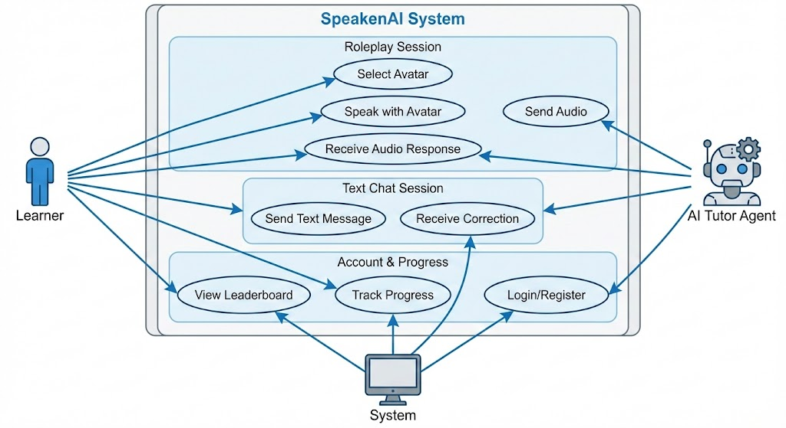
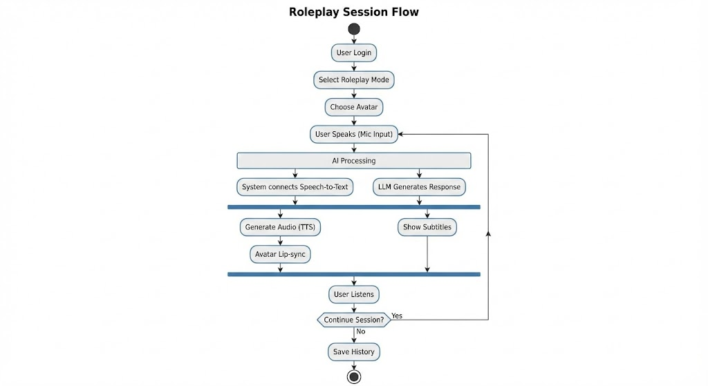
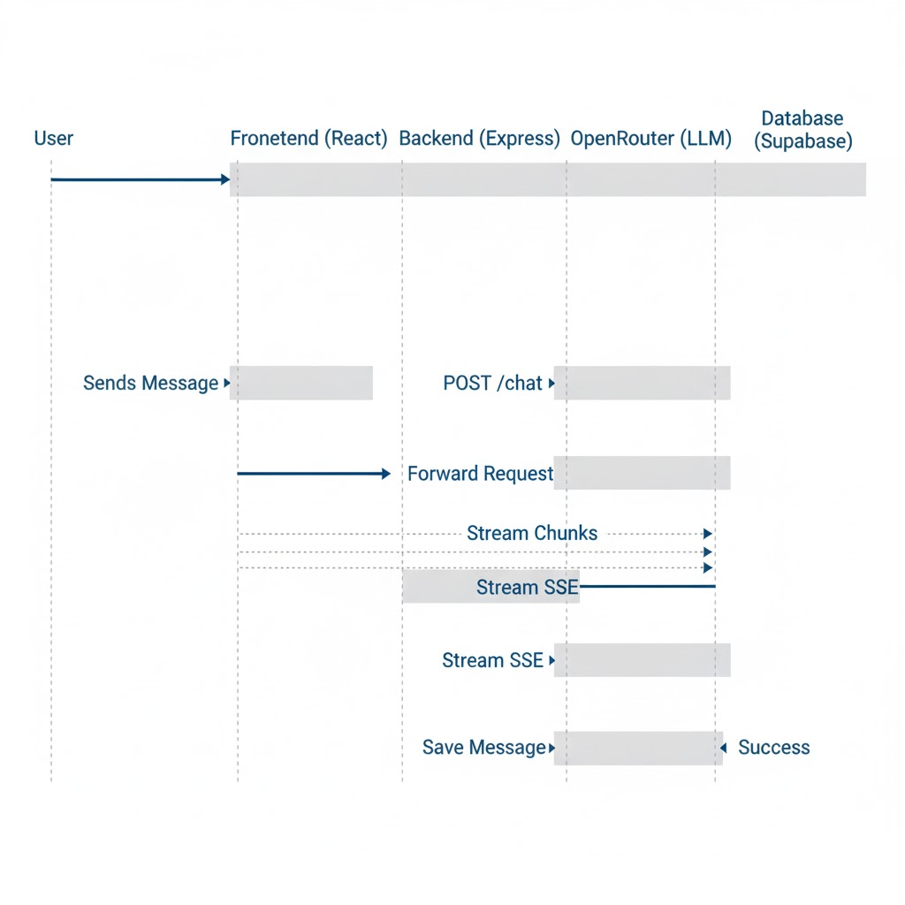
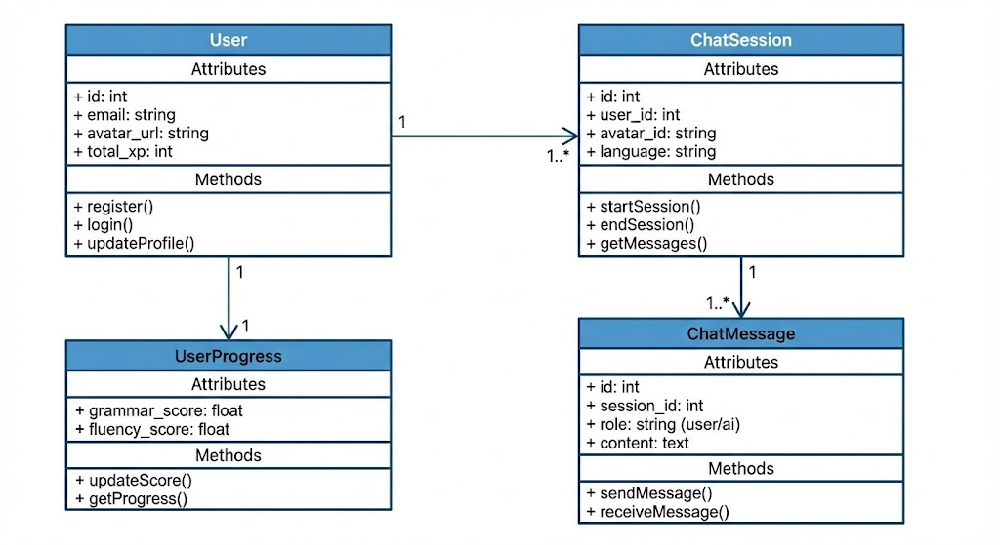

# Perancangan UML SpeakenAI

Dokumen ini berisi diagram UML (Unified Modeling Language) untuk sistem **SpeakenAI Tutor**.

---

## 1. Use Case Diagram

Diagram ini menggambarkan interaksi antara pengguna (Learner) dan sistem, termasuk interaksi dengan AI Tutor.

### Aktor

- **Learner**: Pengguna utama yang belajar bahasa.
- **AI Tutor Agent**: Sistem cerdas yang merespons percakapan.
- **System**: Sistem backend yang menangani autentikasi dan data.

### Use Case Utama

- **Roleplay Session**: Memilih avatar, berbicara, dan menerima respons audio/video.
- **Text Chat Session**: Mengirim pesan teks dan menerima koreksi.
- **Account & Progress**: Melihat leaderboard, tracking progress, dan manajemen profil.

---

## 2. Activity Diagram (Roleplay Flow)

Diagram ini menjelaskan alur aktivitas pengguna dalam sesi Roleplay, mulai dari login hingga menyelesaikan sesi.

### Alur Proses

1. **Inisiasi**: User login dan memilih mode Roleplay serta Avatar.
2. **Interaksi**: User berbicara (Input Suara).
3. **Proses AI**: Sistem melakukan Speech-to-Text (STT) dan LLM generating response.
4. **Output Parallel**:
   - **Audio Visual**: TTS menghasilkan suara dan Avatar melakukan lip-sync.
   - **Teks**: Subtitle ditampilkan di layar.
5. **Looping**: Sesi berlanjut hingga user memilih berhenti.
6. **Penyimpanan**: Riwayat chat disimpan ke database.

---

## 3. Sequence Diagram (Chat Flow)

Diagram ini menunjukkan urutan interaksi antar objek (Frontend, Backend, External APIs) dalam waktu tertentu.

### Alur Pesan

1. User mengirim pesan dari Frontend.
2. Frontend me-request API ke Backend.
3. Backend mem-proxy request ke OpenRouter LLM dengan mode streaming.
4. **Streaming Response**: Chunks data dikirim dari OpenRouter -> Backend -> Frontend (via SSE).
5. Setelah stream selesai, pesan disimpan ke Database (Supabase).
6. UI di-update secara real-time.

---

## 4. Class Diagram (Data Models)

Diagram ini menggambarkan struktur database dan hubungan antar entitas data.

### Entitas Utama

- **User**: Menyimpan data akun, profile, streak, dan total XP.
- **ChatSession**: Sesi percakapan yang menghubungkan User dengan Avatar/Bahasa tertentu.
- **ChatMessage**: Log pesan individu dalam sebuah sesi (role user/assistant).
- **UserProgress**: Melacak skor spesifik (grammar, fluency) untuk analitik.
- **Challenge**: Tantangan gamifikasi yang diikuti user.

### Hubungan

- **User** memiliki banyak **ChatSession** (1..\*).
- **ChatSession** memiliki banyak **ChatMessage** (1..\*).
- **User** memiliki satu **UserProgress** (1..1).

---

_Dokumen ini dibuat untuk melengkapi dokumentasi teknis Speaken-AI-Tutor_  
_Terakhir diperbarui: 20 Januari 2026_
